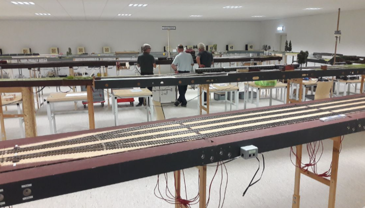
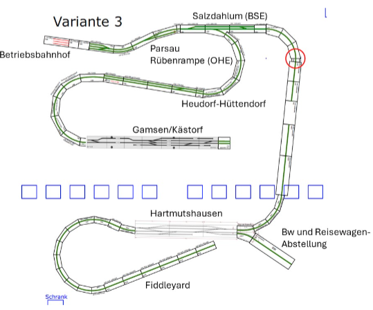
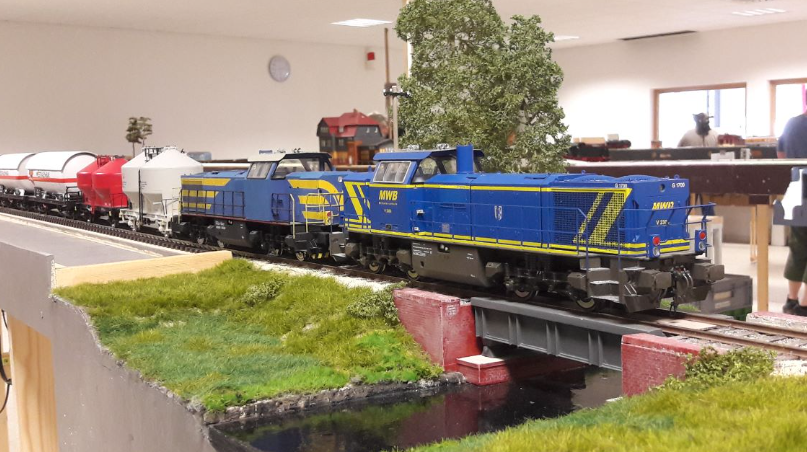

# Modellbahngruppe Papenteich

## Hallo Du

Wir suchen Dich und all die Mitmacher, die am Modellbau im Eisenbahnwesen Freude haben.
Wir möchten Dir zeigen, wieviel Spaß und gegenseitige Wertschätzung gemeinsamer
Betrieb auf Modulen und/oder Anlagen bedeuten kann. Gegenseitige Hilfestellung bei
bastlerischen Herausforderungen sind selbstverständlich. Unsere Gruppe verfügt über
langjährige Erfahrung in allen Bereichen des Modellbaues.

Für alle, die sich jetzt angesprochen fühlen - wir sind Bastler, Vorbildbahner,
Betriebsbahner, Spiel- und Vitrinenbahner, Börsenhengste, Nietenzähler, 3D-
Drucker, Selbstbauer, Eisenbahnhistoriker, Sammler und vieles mehr. Wir sind in der Region für die Region aktiv, wobei es da keine wirklichen Grenzen gibt.

## Treffen

Wir sind aktiv im [Papenteich](https://de.wikipedia.org/wiki/Samtgemeinde_Papenteich) seit
1999 und haben seitdem viele Modultreffen durchgeführt.

- Regionaltreffen
- Jahreshauptversammlung des FREMO im Jahr 2000 in Meine

In den letzten Jahren sind wir ausgewichen auf Veranstaltungen im 4G-Zentrum in Wathlingen bei Celle, sowie im Schützenheim des örtlichen Schützenvereins in Meine, da das bisherige ältere Gemeinschaftszentrum unserer Gemeinde anderer Nutzung seit 2015 zugeführt ist.

## Maßstäbe

- N (1:160)
- H0 (1:87)
- 0 (1:45 bzw 1:43,5)

Schwerpunkt waren bisher die Baugrößen N und Spur 0.

## Historie

Hervorgegangen ist die Gruppe ursprünglich aus Spur N-Bahnern. Diese sind auch weiterhin
beim [Braunschweiger N-Bahn-Stammtisch](https://www.rentsch-online.net/nbahnbraunschweig/) aktiv. Darüber hinaus haben sich viele Aktivitäten für die Spur 0 in den letzten Jahren entwickelt. Seit 2019 nehmen wir in dieser Baugröße an Veranstaltungen teil und haben auch bereits mehrere Treffen organisiert.

Eine Vereinsstruktur gibt es bisher nicht. Ausgeschlossen ist das aber nicht, wenn es um das
Thema für den Zugang zu geeigneten Räumlichkeiten für Ausstellungen und Modultreffen in
der Gemeinde Meine geht. Der modulare Ansatz bietet die Möglichkeit, getrennt zu bauen,
zu lagern und gemeinsam zu spielen, wenn für ein Wochenende eine Räumlichkeit zur Verfügung steht.

## Stammtisch

Einen Stammtisch der Mobagruppe Papenteich in unserer Gemeinde Papenteich gibt es bisher noch nicht regelmäßig. Aber wir nehmen am Braunschweiger N-Bahn-Stammtisch teil. Dieser findet jeden 1. Montag im Monat ab 19:00 Uhr im
Gartenlokal des Kleingarten Eichtal e.V. im Braunschweiger Norden statt.

In Vorbereitung sind Treffen beim Schützenverein in Meine auf besondere Veranlassung, zumeist
Freitags ab 19:00 Uhr mit vorheriger Ankündigung. Auch nehmen wir am Braunschweiger
Großspurstammtisch teil, der am 1. Mittwoch eines Monats ab 17:00 Uhr in der Gaststätte des
Sportvereins „Rote Wiese“ in Braunschweig stattfindet.

## Kontakt

Interesse? Mach mit! Wer sich gern aktiv oder auch unterstützend einbringen möchte, melde sich bitte bei **Ubbo Lanske**. Mailadresse: info@n-bahn-braunschweig.de

## Modultreffen Meine Juni 2024

Arrangementplan

## Impressum

~~~
Ubbo Lanske
Rübenweg 3
38527 Meine

Telefon: 05304-930045
Mail: info@n-bahn-braunschweig.de
~~~

